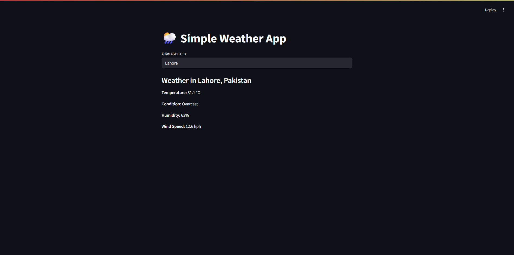

# ☁️ Weather App – Python + Streamlit + API

This project is a simple weather dashboard built using Python and Streamlit. It fetches real-time weather data using an external API and displays it in a user-friendly web interface.

---

## 🔧 Built With

- **Python 3**
- **Streamlit** for web interface
- **Weatherapi API** for live data
- `requests`, `json` modules

---

## 🖼️ Screenshot



---

## 🚀 How to Run

### 1. Clone the repository

```bash
git clone https://github.com/AsadAli0456/Portfolio.git
cd python/weather-app
pip install streamlit
streamlit run weather_app.py

